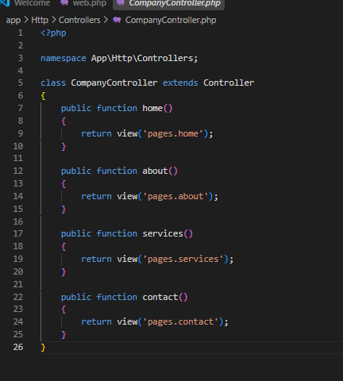
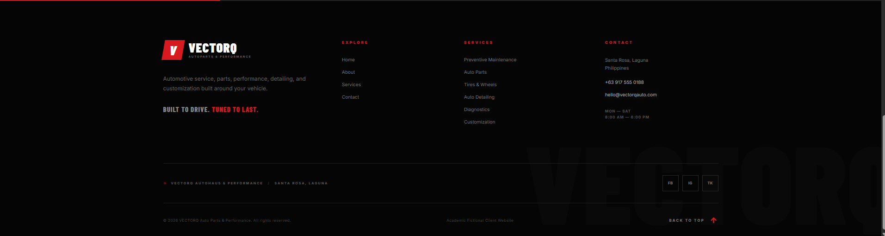

# VECTORQ Auto Parts & Performance

## Company Profile Website

A Laravel-based company profile website developed for **ITST 302 – Client-Server Technologies**.

VECTORQ Auto Parts & Performance is an automotive company based in Santa Rosa, Laguna. The website presents the company's services, background, and contact information through a responsive multi-page Laravel application.

---

## 1. Project Title

**VECTORQ Auto Parts & Performance – Company Profile Website**

---

## 2. Introduction

A company profile website gives customers an easy way to learn about a business, its services, background, and contact information.

For this project, I developed a website for **VECTORQ Auto Parts & Performance**, an automotive business based in Santa Rosa, Laguna. The website presents services such as preventive maintenance, auto parts, tires and wheels, detailing, diagnostics, accessories, and vehicle customization.

The project was created to apply Laravel MVC concepts while building a responsive and organized website. I used Laravel routes, a controller, Blade templates, custom CSS, JavaScript, reusable components, and Vite for managing frontend assets.

---

## 3. Objectives

The objectives of this project were to:

- Build Home, About, Services, and Contact pages.
- Configure Laravel GET and named routes.
- Use `CompanyController` to handle page requests.
- Use Blade layouts and reusable components.
- Create reusable navbar and footer components.
- Apply custom CSS and JavaScript.
- Make the website responsive across different screen sizes.
- Follow Laravel's MVC structure.
- Organize files using Laravel's standard folder structure.

---

## 4. MVC Architecture

### What is MVC?

MVC stands for **Model-View-Controller**, an architectural pattern that separates an application into different responsibilities.

- **Model** – Manages application data and database operations.
- **View** – Displays the user interface and content to the user.
- **Controller** – Handles requests and determines which view or action should be returned.

This project mainly uses the Controller and View because the current website does not require database operations.

### Why Laravel Uses MVC

Laravel uses MVC to separate the different responsibilities of an application. This keeps the routes, application logic, and user interface organized instead of placing everything in one file.

### Advantages of MVC

MVC provides several advantages:

- Better code organization
- Easier maintenance
- Reusable code
- Easier debugging
- Clear separation of responsibilities
- Better structure for larger applications

### Laravel Request Flow

The diagram below shows how a request moves through the VECTORQ Laravel application, starting from the browser and returning the completed page to the user.


---

## 5. Laravel Routing

### What is Routing?

Routing determines what Laravel should do when a user visits a specific URL. The routes for this project are stored inside `routes/web.php`.

### Named Routes

Named routes allow me to refer to a route by its assigned name instead of manually writing its URL. This also makes navigation links easier to maintain.

Example:

```blade
<a href="{{ route('services') }}">Services</a>
```

### GET Requests

I used GET requests because the main pages of the website are used to display information to the user.

```php
Route::get('/', [CompanyController::class, 'home'])->name('home');
Route::get('/about', [CompanyController::class, 'about'])->name('about');
Route::get('/services', [CompanyController::class, 'services'])->name('services');
Route::get('/contact', [CompanyController::class, 'contact'])->name('contact');
```

### Route Definitions

A route contains the HTTP request type, URL, controller method, and route name. These routes connect each website URL to its corresponding method inside `CompanyController`.

### Route Definitions Screenshot


---

## 6. Controllers

### Purpose of Controllers

Controllers handle incoming requests and connect routes to the correct Blade views.

### Benefits of Controllers

Controllers keep request-handling logic separate from routes and views, which makes the project easier to organize, maintain, and debug.

### Controller Methods

The `CompanyController` contains a method for each main page of the website:

```php
public function home()
{
    return view('pages.home');
}

public function about()
{
    return view('pages.about');
}

public function services()
{
    return view('pages.services');
}

public function contact()
{
    return view('pages.contact');
}
```

Each method returns the Blade view that corresponds to the page requested by the user.

### CompanyController Screenshot



---

## 7. Blade Templating Engine

### Blade Layouts

Blade layouts provide a shared structure that can be reused across different pages. They help keep common parts of the website consistent without repeating the same code.

### Blade Components

Blade components are reusable sections of a webpage. In this project, the navbar and footer are separated into their own Blade files so they can be reused across the Home, About, Services, and Contact pages.

### `@extends`

`@extends` connects a Blade page to an existing layout, allowing different pages to use the same main website structure.

```blade
@extends('layouts.app')
```

### `@section`

`@section` defines the content for a specific part of a Blade layout, allowing every page to contain its own information while sharing the same structure.

```blade
@section('content')
    <!-- Page content -->
@endsection
```

### `@yield`

`@yield` marks the location in the main layout where content from a `@section` will be displayed.

```blade
@yield('content')
```

### `@include`

`@include` inserts another Blade file into the current file and is useful for reusable sections such as the navbar and footer.

```blade
@include('components.navbar')
@include('components.footer')
```

### Blade Layout Screenshot


---

## 8. Laravel Folder Structure

The project follows Laravel's standard folder structure while keeping the frontend files and documentation organized.

```text
week03-company-profile/
│
├── app/
│   └── Http/
│       └── Controllers/
│           └── CompanyController.php
│
├── bootstrap/
├── config/
├── database/
│
├── documentation/
│   └── Architecture diagram.png
│
├── public/
│   └── images/
│
├── resources/
│   ├── css/
│   ├── js/
│   └── views/
│       ├── components/
│       │   ├── footer.blade.php
│       │   └── navbar.blade.php
│       ├── layouts/
│       │   └── app.blade.php
│       └── pages/
│           ├── about.blade.php
│           ├── contact.blade.php
│           ├── home.blade.php
│           └── services.blade.php
│
├── routes/
│   └── web.php
│
├── screenshots/
├── storage/
├── tests/
├── vendor/
├── README.md
├── package.json
├── package-lock.json
└── vite.config.js
```

### Folder Purposes

**`app/`** contains the main application code, including controllers and other core application logic.

**`routes/`** contains route definitions that connect incoming URLs to their corresponding controller methods.

**`resources/`** contains Blade views, custom CSS, and JavaScript used to build the website interface.

**`public/`** contains publicly accessible files such as images and compiled frontend assets.

**`bootstrap/`** contains files Laravel uses when starting the application and managing framework cache files.

**`config/`** contains configuration files that control Laravel's application settings and services.

### VS Code Project


### Laravel Folder Structure


---

## 9. Project Screenshots

### Home Page


### About Page


### Services Page


### Contact Page


### Navigation Bar


### Footer



### Route Definitions


### Controller


### Blade Layout


### Architecture Diagram


### VS Code Project


### Laravel Folder Structure


### GitHub Repository


### Browser Output


---

## 10. Problems Encountered

### Problem 1: Custom CSS Was Not Loading

My custom CSS was not being recognized even though the Blade pages were already working correctly.

### Problem 2: Node.js and Vite Setup

I discovered that Node.js and npm were needed because Laravel uses Vite to process and load the CSS and JavaScript files used by the project.

### Problem 3: Images and Recent Changes Were Not Appearing

Some images did not appear because of incorrect file paths. There were also times when recent CSS or JavaScript changes did not immediately appear in the browser.

---

## 11. Solutions

### Solution 1: Configure CSS and JavaScript

I added the required CSS and JavaScript files to the `@vite` directive inside `app.blade.php` so Laravel could load the frontend assets correctly.

### Solution 2: Install Node.js and Run Vite

I installed the required npm packages using:

```bash
npm install
```

Then I started the Vite development server:

```bash
npm run dev
```

After configuring Vite correctly, my custom CSS and JavaScript loaded properly in the browser.

### Solution 3: Correct Image Paths

I placed the website images inside:

```text
public/images/
```

Then I referenced them using Laravel's `asset()` helper.

```blade

```

I also checked that the files were saved correctly, Vite was running, and the browser was refreshed after making changes.

---

## 12. Reflection

This project gave me a better understanding of the Model-View-Controller (MVC) architecture because I was able to apply it in an actual Laravel project instead of only learning about it through examples. Before working on the VECTORQ website, I understood that MVC separated an application into different parts, but I was not completely familiar with how those parts worked together. While developing the website, I learned how Laravel receives a request through a route, passes it to a controller, and then uses a Blade view to display the final page in the browser. Although this project does not currently require a database, I also learned that the Model would be responsible for handling application data when it is needed.

I also learned why separation of concerns is important in web development. Keeping routes, controllers, views, CSS, and JavaScript in their own files made the project easier for me to understand and manage. Instead of putting everything into one large file, I could work on a specific part of the website without affecting unrelated sections. Using a shared Blade layout and reusable navbar and footer components also reduced repeated code. If I needed to change the navigation bar, for example, I only had to update one file instead of editing every page separately.

The Laravel request flow became much clearer while working on the different pages. When a user visits the `/services` URL, the route in `web.php` sends the request to the `services()` method inside `CompanyController`. The controller then returns the Services Blade view, which uses the shared layout and components before Laravel sends the completed page back to the browser. Building this myself helped me understand how routes, controllers, and views depend on each other.

I also encountered challenges while setting up the frontend of the project. My custom CSS did not load correctly at first because the assets needed to be configured through Vite. I had to make sure Node.js and the required npm packages were installed, configure the frontend files, and run the Vite development server. I also had to correct some image paths when images were not appearing properly. Solving these problems helped me understand that developing a website is not only about writing code but also about knowing how the tools and project structure work together.

For larger enterprise systems, I think MVC becomes even more useful because an application can contain many features, users, controllers, models, and views. Separating these responsibilities can make a large system easier to maintain, test, debug, and update. It can also help development teams work on different parts of the same application without constantly editing the same files. Overall, this project helped me understand Laravel MVC more clearly and showed me how an organized structure can make web development easier to manage.

---

## 13. References

Laravel. (n.d.). *Laravel 12.x documentation*. Laravel.  
https://laravel.com/docs/12.x

MDN Web Docs. (n.d.). *MDN Web Docs*. Mozilla.  
https://developer.mozilla.org/en-US/

PHP Documentation Group. (n.d.). *PHP manual*. PHP.  
https://www.php.net/manual/en/

MDN Web Docs
MDN Web Docs. (n.d.). https://developer.mozilla.org/en-US/


---